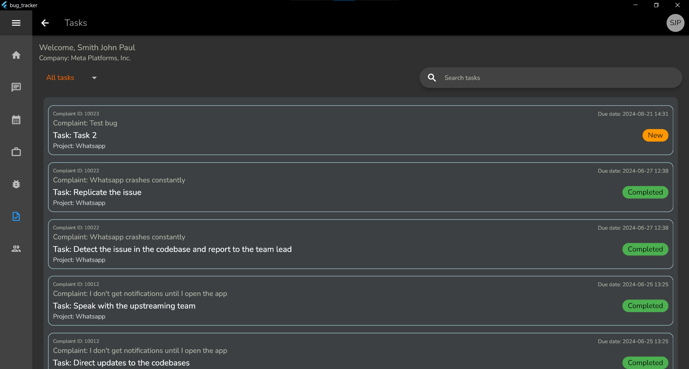
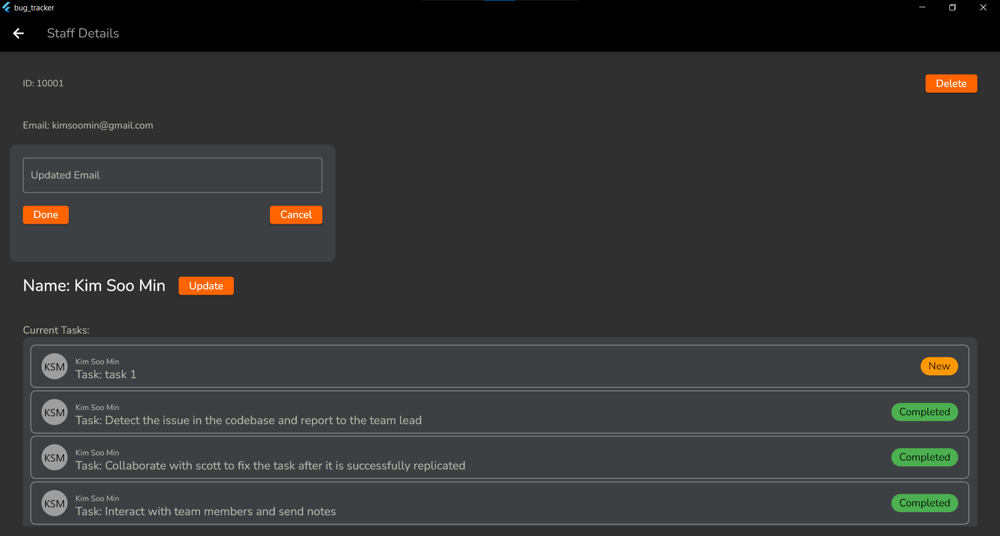
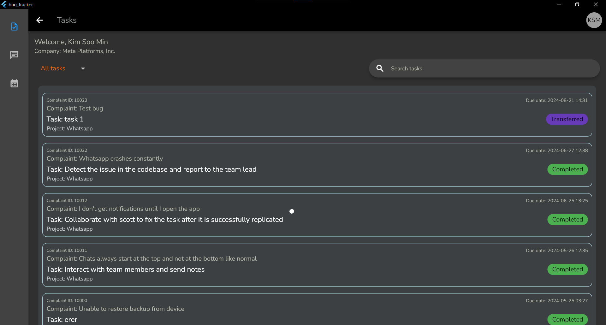

# Bug Tracker
This is a bug tracking application developed using Flutter, built for windows for my final year project. The application enables development teams to receive bug reports from customers, assign tasks to staff for resolution, and monitor progress. Customers can also track the progress and solution plans of these reports, leading to a more transparent system.

Insipred by Zoho bug tracker application [https://www.zoho.com/bugtracker/].

## Features
- Report and track bugs
- Assign tasks to team members for bug resolution
- Monitor progress of bug resolution
- Customers can track progress and solution plans
- Staff-staff messaging
- Calendar including adding activities
- Work session tracking
- Automatic progression e.g. when a complaint is opened by the admin the state is changed from pending to acknowledged automatically.

## UI samples
Note: not an exhaustive list of the entire UI

|                          |                          |
|--------------------------|--------------------------|
  |  
> sign in  and sign up pages

 

> User's dashboard

 

> User's complaint submission form

 

> User's complaint detail page (after clicking on a complaint)

 

> Admin home page

 

|                          |                          |
|--------------------------|--------------------------|
  |  
> Admin's bugs overview

 

> Admin's projects overview

 

|                          |                          |
|--------------------------|--------------------------|
  |  
> Project details (after clicking a project)

 

> Tasks page (Same format for admin and staff)

 

> Staff page

 

> View staff information and ability to modify some data

 

> Inbuilt calendar with ability to add activities

 

|                          |                          |
|--------------------------|--------------------------|
  |   
> Transfer task ability

 

|                          |                          |
|--------------------------|--------------------------|
  |   
> Inbuilt chat feature

 

> Time tracking feature

 

|                          |                          |
|--------------------------|--------------------------|
 |   
> View (time tracked) sessions log

## Comments
- Pretty well commented codebase
- Doesn't work on web due to mysql1 package using sockets which flutter web doesnt support
- Plan to add a generate payment invoice feature based on hourly pay

## Setup
1. Install Flutter on your machine.
2. Clone this repository.
3. Run `flutter pub get` to install the necessary packages.
4. Create MySQL database with the sql file and modify credentials in db.dart file
5. Run `flutter run` to start the application.
6. Select Windows as the build choice
